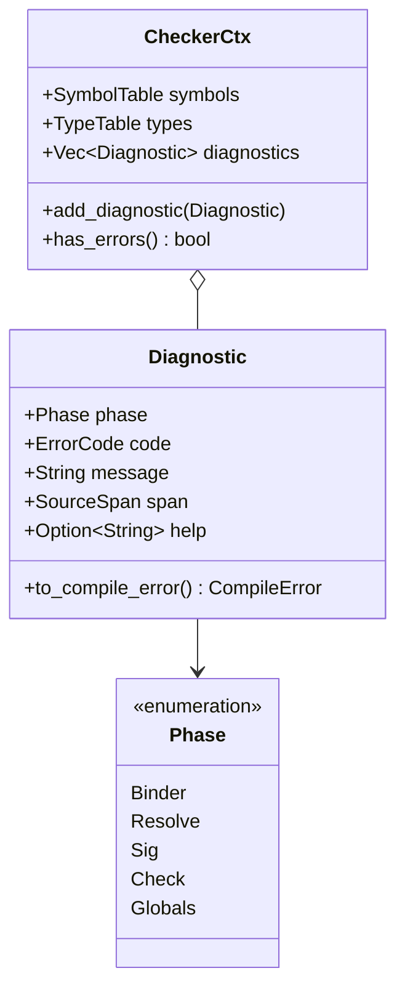
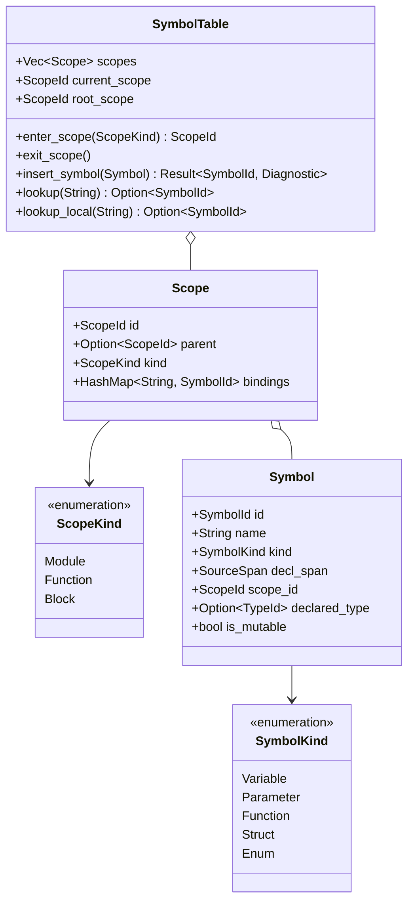
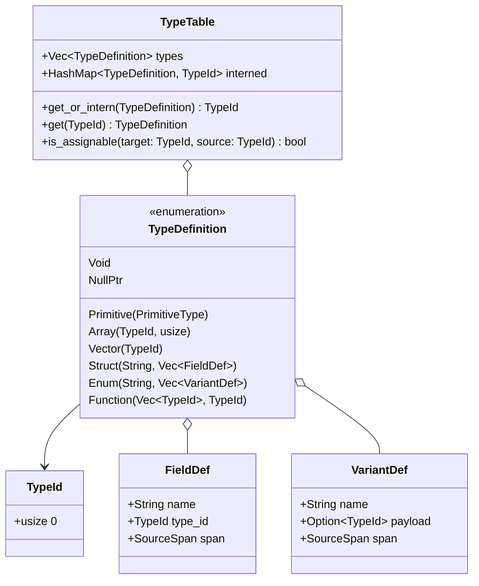

# Data Model: Semantic Type Checking

**Feature**: `001-type-checking` | **Date**: 2026-09-15 | **Spec**: [spec.md](spec.md)

This document defines the core data structures, relationships, validation invariants, and state transitions for the semantic type checker in `descar-core`.

---

## 1. Core Context & Phase Model



### 1.1 `Phase`

Represents the compilation phase responsible for an operation or diagnostic:

```rust
#[derive(Debug, Clone, Copy, PartialEq, Eq, Hash)]
pub enum Phase {
    Binder,
    Resolve,
    Sig,
    Check,
    Globals,
}
```

### 1.2 `Diagnostic`

Carries complete source and diagnostic information tagged with the origin phase:

```rust
pub struct Diagnostic {
    pub phase: Phase,
    pub code: ErrorCode,
    pub message: String,
    pub span: SourceSpan,
    pub help: Option<String>,
}
```

**Invariants**:

- `span` must denote a valid location in source code.
- `help` must provide actionable fix guidance (FR-006).
- Maps directly to `CompileError::TypeError` for consumption by `ErrorReporter` (FR-013).

---

## 2. Symbol Table & Scope Tree (`binder` & `resolve`)



### 2.1 `Scope` and `ScopeTree`

- Scope hierarchy is stored as an indexed arena: `Vec<Scope>` with `ScopeId(usize)`.
- Parent references are `Option<ScopeId>`. No reference counting or interior mutability (`Rc<RefCell<_>>`).
- **Inner-to-outer resolution** (FR-014):
  1. Check `current_scope.bindings`.
  2. If absent, follow `scope.parent` upwards until `root_scope` (Module scope).
  3. If not found in `root_scope`, lookup fails and emits an undeclared identifier diagnostic (FR-014, User Story 6).

### 2.2 Validation Invariants

- **Duplicate Declaration** (User Story 5): Inserting a symbol with name $N$ into scope $S$ when $S$ already contains an entry for $N$ fails immediately with a `Binder` duplicate declaration diagnostic. Shadowing in child scopes is permitted (User Story 4).

---

## 3. Type Table & Type Definitions (`sig` & `check`)



### 3.1 `TypeId` Constants & Primitive Types

`TypeTable` pre-populates standard primitive `TypeId`s at initialization:

- Signed Integers: `I8`, `I16`, `I32`, `I64`
- Unsigned Integers: `U8`, `U16`, `U32`, `U64`
- Floating Point: `F32`, `F64`
- Others: `Char`, `String`, `Bool`, `Void`, `NullPtr`

### 3.2 Type Validation Rules

1. **Nominal Typing** (Clarification 2026-09-15): Structs and enums are compared nominally by their `TypeId` / unique declaration identity, never structurally.
2. **Cycle & Infinite Size Detection** (User Story 8, FR-007):
   - A struct or enum field whose type directly or transitively contains the declaring type without indirection (e.g. pointer or dynamic vector) creates an infinite size layout.
   - Detected during Phase 3 (`sig`) by tracking a DFS `in_progress` set of types. Cycles trigger a blocking `Sig` diagnostic.
3. **Void Placement** (FR-010):
   - `Void` is strictly valid as a function return type.
   - Variable declarations with type `Void` (`let x: void`) are rejected with `CompileError::TypeError`.
4. **No Implicit Coercion** (FR-011):
   - Explicit casts required for mixed integer/float operations (`i32` + `f64` rejected).
   - Array literals must match declared array length and homogeneous element type.

---

## 4. Expression Checking & Expectations (`check`)

### 4.1 `Expectation` Model

```rust
#[derive(Debug, Clone, Copy, PartialEq, Eq)]
pub enum Expectation {
    /// Infer type purely from expression syntax.
    Infer,
    /// Validate expression against an expected type.
    Check(TypeId),
}
```

### 4.2 Numeric Contextual Typing Rules (FR-001, FR-002)

- **Unsuffixed Numeric Literals** (e.g., `42`):

    - Under `Expectation::Check(t)` where `t` is integer/float: Adopt type `t` if the literal value falls within `t`'s min/max range.
    - Under `Expectation::Infer`: Defaults to `I32` for integers or `F64` for decimals.

- **Suffixed Numeric Literals** (e.g., `42u8`, `3.14f32`):

    - Retain their explicit type regardless of expectation. If checked against incompatible `Expectation::Check(t)`, emit mismatch diagnostic.

---

## 5. Pipeline State Transitions

```mermaid
stateDiagram-v2
    [*] --> UncheckedAST: Parser output

    UncheckedAST --> ScopedAST: binder::bind(AST, &mut ctx)
    note right of ScopedAST: Top-level decls registered,\nScope hierarchy constructed

    ScopedAST --> ResolvedAST: resolve::resolve(AST, &mut ctx)
    note right of ResolvedAST: Variable/Type usages linked to SymbolIds,\nUndeclared names flagged

    ResolvedAST --> SignedAST: sig::process_signatures(AST, &mut ctx)
    note right of SignedAST: Signatures computed in TypeTable,\nInfinite-size cycles detected

    SignedAST --> TypedAST: check::check_bodies(AST, &mut ctx)
    note right of TypedAST: Bodies checked against Expectation,\nExpressions annotated with TypeId

    TypedAST --> CheckedProgram: globals::check_globals(AST, &mut ctx)
    note right of CheckedProgram: Whole-program checks (unused items, visibility)

    CheckedProgram --> [*]: Success: Ok(CheckedProgram)
    CheckedProgram --> [*]: Errors: Err(Vec<Diagnostic>)
```
