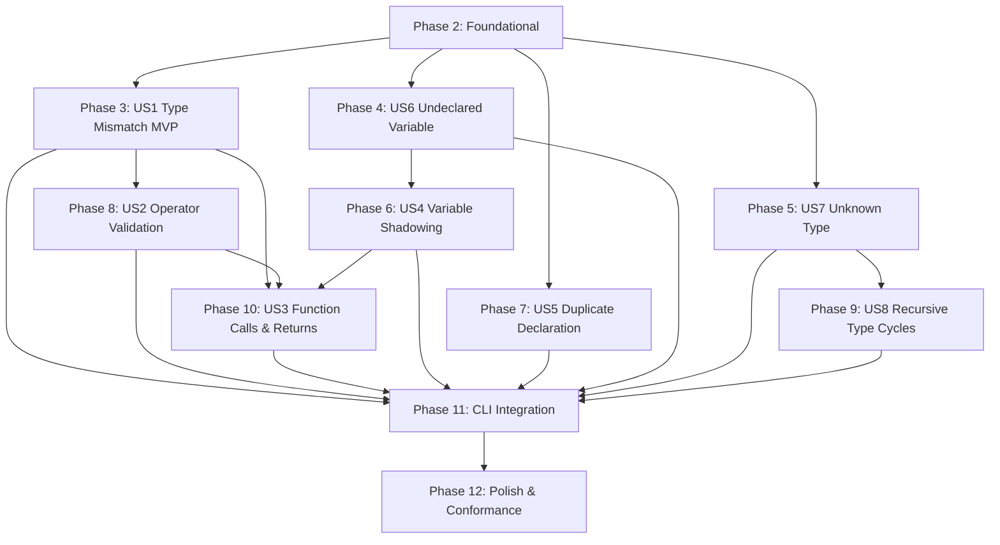

# Tasks: Semantic Type Checking

**Input**: Design documents from `/specs/001-type-checking/`
**Prerequisites**: plan.md (required), spec.md (required for user stories), research.md, data-model.md, contracts/

## Format: `[ID] [P?] [Story] Description`

- **[P]**: Can run in parallel (different files, no dependencies on incomplete tasks)
- **[Story]**: Which user story this task belongs to (e.g., [US1], [US2], [US3]...)
- All tasks include exact file paths in their descriptions.
- Each task represents a circumscribed, single-responsibility unit of work with clear boundaries and verifiable completion criteria.

---

## Phase 1: Setup (Shared Infrastructure)

**Purpose**: Project initialization, toolchain pinning, dependency configuration, and base module scaffolding.

- [ ] T001 Pin Rust compiler version by creating `rust-toolchain.toml` with `channel = "1.98.1"` in `rust-toolchain.toml`
- [ ] T002 Add `insta = { workspace = true }` under `[dev-dependencies]` in `crates/descar/Cargo.toml`
- [ ] T003 [P] Create initial test fixture directory structure and baseline valid source file in `crates/descar/tests/fixtures/valid_simple.dr`
- [ ] T004 [P] Declare semantic subsystem submodules (`binder`, `resolve`, `sig`, `check`, `globals`, `diag`, `ctx`) in `crates/descar-core/src/semantic/mod.rs` and re-export `pub mod semantic;` in `crates/descar-core/src/lib.rs`

---

## Phase 2: Foundational (Blocking Prerequisites)

**Purpose**: Core infrastructure, data structures, symbol table scope arena, type intern table, and diagnostic bridge that MUST be complete before ANY user story can be implemented.

**⚠️ CRITICAL**: No user story work can begin until this phase is complete.

### Scope Arena & Symbol Table Infrastructure

- [ ] T005 [P] Define `ScopeKind` enum (`Module`, `Function`, `Block`) and `Scope` arena struct with `ScopeId(pub usize)` and parent pointer `Option<ScopeId>` in `crates/descar-core/src/semantic/ctx.rs`
- [ ] T006 Implement scope hierarchy management methods `enter_scope(kind: ScopeKind) -> ScopeId` and `exit_scope()` on `SymbolTable` in `crates/descar-core/src/semantic/ctx.rs`
- [ ] T007 Implement symbol record model `Symbol` with `SymbolKind` (`Variable`, `Parameter`, `Function`, `Struct`, `Enum`) and insertion method `SymbolTable::insert_symbol` in `crates/descar-core/src/semantic/ctx.rs`
- [ ] T008 Implement inner-to-outer resolution methods `lookup_local` and `lookup` on `SymbolTable` quoting verbatim rule "1. Check current_scope.bindings. 2. If absent, follow scope.parent upwards until root_scope (Module scope). 3. If not found in root_scope, lookup fails" in `crates/descar-core/src/semantic/ctx.rs`
- [ ] T009 Add unit tests for `SymbolTable` verifying scope tree creation, symbol insertion, child shadowing, and parent traversal lookup in `crates/descar-core/src/semantic/ctx.rs`

### Type Table & Type Model Infrastructure

- [ ] T010 [P] Define `TypeId(pub usize)`, `TypeDefinition`, `TypeKey`, and `NominalKind` enums in `crates/descar-core/src/semantic/ctx.rs`
- [ ] T011 Pre-populate standard primitive `TypeId` constants (`I8`, `I16`, `I32`, `I64`, `U8`, `U16`, `U32`, `U64`, `F32`, `F64`, `Char`, `String`, `Bool`, `Void`, `NullPtr`) in `TypeTable::new` in `crates/descar-core/src/semantic/ctx.rs`
- [ ] T012 Implement structural type interning method `TypeTable::get_or_intern` using `TypeKey::Structural` in `crates/descar-core/src/semantic/ctx.rs`
- [ ] T013 Implement two-stage nominal registration methods `TypeTable::reserve_nominal` and `TypeTable::complete` quoting verbatim constraint "Nominal declarations receive their stable TypeId before any field or variant type is resolved. TypeTable::reserve_nominal creates a Reserved(TypeDeclId, kind) slot... complete replaces that slot with the fully resolved TypeDefinition; it must preserve the original TypeId" in `crates/descar-core/src/semantic/ctx.rs`
- [ ] T014 Implement nominal type equality and primitive type assignability in `TypeTable::is_assignable` quoting verbatim constraint "Structs and enums are compared nominally by their TypeId / unique declaration identity, never structurally" in `crates/descar-core/src/semantic/ctx.rs`
- [ ] T015 Add unit tests for `TypeTable` verifying primitive registration, structural interning, nominal reservation/completion, and assignability in `crates/descar-core/src/semantic/ctx.rs`

### Diagnostic Reporting Infrastructure

- [ ] T016 [P] Define `Phase` enum (`Binder`, `Resolve`, `Sig`, `Check`, `Globals`) and `Diagnostic` struct carrying `phase`, `code: ErrorCode`, `message: String`, `span: SourceSpan`, and validated non-empty actionable `help` in `crates/descar-core/src/semantic/ctx.rs`; create diagnostics through a constructor or dedicated non-empty help type so `None` and empty help values cannot be represented
- [ ] T017 Implement conversion method `Diagnostic::to_compile_error` mapping to `CompileError::TypeError` quoting verbatim constraints "span must denote a valid location in source code" and "help must provide actionable fix guidance (FR-006)" in `crates/descar-core/src/semantic/diag.rs`
- [ ] T018 Implement diagnostic accumulation methods `add_diagnostic`, `has_blocking_errors`, and `take_diagnostics` on `CheckerCtx` in `crates/descar-core/src/semantic/ctx.rs`
- [ ] T019 Add unit tests for `Diagnostic` creation, phase tagging, and `to_compile_error` field preservation in `crates/descar-core/src/semantic/diag.rs`

### Orchestrator Pipeline Skeleton

- [ ] T020 Define `CheckedProgram` struct containing `ast`, `symbols`, `types`, `node_types`, and `warnings` in `crates/descar-core/src/semantic/mod.rs`
- [ ] T021 Implement sequential pipeline skeleton function `check_program(ast: &[Stmt]) -> Result<CheckedProgram, Vec<Diagnostic>>` with early termination upon phase failure in `crates/descar-core/src/semantic/mod.rs`

**Checkpoint**: Core foundation ready - user story implementations can now begin.

---

## Phase 3: User Story 1 - Type Error Detection in Declarations & Assignments (Priority: P1) 🎯 MVP

**Goal**: Validate variable declarations, initializers, assignments, literals, and local contextual typing. Report `ErrorCode::E2001` on type mismatch and enforce zero implicit coercion.

**Independent Test**: Compile and type-check variable declarations and assignments (e.g. `var x: i32 = true;` fails with `E2001`; `var x: i32 = 1;` succeeds).

### Tests for User Story 1 (TDD) ⚠️

- [ ] T022 [P] [US1] Write unit test with synthetic AST verifying that variable declaration with mismatched initializer emits `CheckError::TypeMismatch` in `crates/descar-core/src/semantic/check.rs`
- [ ] T023 [P] [US1] Write unit test with synthetic AST verifying that assignment expression with incompatible value emits `CheckError::TypeMismatch` in `crates/descar-core/src/semantic/check.rs`
- [ ] T024 [P] [US1] Write unit test with synthetic AST verifying contextual typing of unsuffixed numeric literals under `Expectation::Check` and default typing under `Expectation::Infer` in `crates/descar-core/src/semantic/check.rs`
- [ ] T025 [P] [US1] Create integration test fixture `crates/descar/tests/fixtures/type_mismatch.dr` and snapshot test asserting E2001 diagnostic output in `crates/descar/tests/type_check_snapshots.rs`

### Implementation for User Story 1

- [ ] T026 [P] [US1] Define `Expectation` enum (`Infer`, `Check(TypeId)`) and `CheckError::TypeMismatch { expected, found, span }` in `crates/descar-core/src/semantic/check.rs`
- [ ] T027 [US1] Implement literal type checking for boolean, string, char, and nullptr literals under `Expectation` in `crates/descar-core/src/semantic/check.rs`
- [ ] T028 [US1] Implement contextual typing for unsuffixed integer and decimal literals quoting verbatim rule "Under Expectation::Check(t) where t is integer/float: Adopt type t if the literal value falls within t's min/max range. Under Expectation::Infer: Defaults to I32 for integers or F64 for decimals" in `crates/descar-core/src/semantic/check.rs`
- [ ] T029 [US1] Implement suffixed numeric literal validation quoting verbatim rule "Retain their explicit type regardless of expectation. If checked against incompatible Expectation::Check(t), emit mismatch diagnostic" in `crates/descar-core/src/semantic/check.rs`
- [ ] T030 [US1] Implement AST primitive type-to-`TypeId` mapping helper `ast_type_to_type_id` in `crates/descar-core/src/semantic/sig.rs`
- [ ] T031 [US1] Implement variable declaration checking (`Stmt::VarDeclaration`) verifying each binding initializer against declared type and storing resolved type in `crates/descar-core/src/semantic/check.rs`
- [ ] T032 [US1] Implement rejection of `void` type in variable declarations with `ErrorCode::E2030` quoting verbatim constraint "Void is strictly valid as a function return type. Variable declarations with type Void (var x: void) are rejected with CompileError::TypeError" in `crates/descar-core/src/semantic/ctx.rs`
- [ ] T033 [US1] Implement assignment expression checking (`Expr::Assign`) validating that assigned value type matches target variable type and rejecting non-assignable targets in `crates/descar-core/src/semantic/check.rs`
- [ ] T034 [US1] Implement statement list traversal entry function `check::check_bodies(ast: &[Stmt], ctx: &mut CheckerCtx)` in `crates/descar-core/src/semantic/check.rs`

**Checkpoint**: User Story 1 is functional and independently testable as the core MVP.

---

## Phase 4: User Story 6 - Undeclared Variable Detection (Priority: P1)

**Goal**: Detect variable and identifier references that are not declared in any accessible scope and emit `ErrorCode::E2002` with precise span and actionable fix suggestion.

**Independent Test**: Type-check an expression with an undefined identifier (e.g. `var y = x + 1;`) and verify `CompileError::TypeError` with `ErrorCode::E2002` is emitted.

### Tests for User Story 6 (TDD) ⚠️

- [ ] T035 [P] [US6] Write unit test with synthetic AST verifying that referencing an undeclared identifier produces `ResolveError::UndeclaredIdentifier` in `crates/descar-core/src/semantic/resolve.rs`
- [ ] T036 [P] [US6] Create integration test fixture `crates/descar/tests/fixtures/undeclared_var.dr` and snapshot test asserting E2002 diagnostic output in `crates/descar/tests/type_check_snapshots.rs`

### Implementation for User Story 6

- [ ] T037 [P] [US6] Define `ResolveError::UndeclaredIdentifier { name: String, span: SourceSpan }` and its `Display` implementation in `crates/descar-core/src/semantic/resolve.rs`
- [ ] T038 [US6] Implement expression identifier resolution looking up `Expr::Variable` in `ctx.symbols` via `lookup` in `crates/descar-core/src/semantic/resolve.rs`
- [ ] T039 [US6] Emit `ErrorCode::E2002` diagnostic with identifier name, source span, and fix suggestion when variable is missing from all accessible scopes in `crates/descar-core/src/semantic/resolve.rs`
- [ ] T040 [US6] Implement statement traversal entry function `resolve::resolve(ast: &[Stmt], ctx: &mut CheckerCtx)` in `crates/descar-core/src/semantic/resolve.rs`

**Checkpoint**: User Story 6 is functional and independently testable.

---

## Phase 5: User Story 7 - Unknown Type Resolution (Priority: P1)

**Goal**: Detect usages of undefined type identifiers in type annotations and emit `ErrorCode::E2004` with precise source span and actionable fix suggestion.

**Independent Test**: Type-check a declaration with an undefined type (e.g. `var x: UnknownType = 1;`) and verify `CompileError::TypeError` with `ErrorCode::E2004` is emitted.

### Tests for User Story 7 (TDD) ⚠️

- [ ] T041 [P] [US7] Write unit test with synthetic AST verifying that an unrecognized custom type annotation produces `ResolveError::UnknownType` in `crates/descar-core/src/semantic/resolve.rs`
- [ ] T042 [P] [US7] Create integration test fixture `crates/descar/tests/fixtures/unknown_type.dr` and snapshot test asserting E2004 diagnostic output in `crates/descar/tests/type_check_snapshots.rs`

### Implementation for User Story 7

- [ ] T043 [P] [US7] Define `ResolveError::UnknownType { name: String, span: SourceSpan }` and its `Display` implementation in `crates/descar-core/src/semantic/resolve.rs`
- [ ] T044 [US7] Implement type annotation validation looking up `Type::Custom { name }` in `TypeTable` nominal registry in `crates/descar-core/src/semantic/resolve.rs`
- [ ] T045 [US7] Emit `ErrorCode::E2004` diagnostic with type name, source span, and fix suggestion when custom type is not found in `crates/descar-core/src/semantic/resolve.rs`
- [ ] T046 [US7] Implement recursive validation for composite type annotations (`Type::Array`, `Type::Vector`) and validate array-size expressions so non-constant or negative values produce the `InvalidArraySize` diagnostic (`E2031`) in `crates/descar-core/src/semantic/resolve.rs`
- [ ] T046a [P] [US7] Add focused tests for array-size validation covering non-constant and negative values and asserting the `InvalidArraySize` diagnostic code `E2031` in `crates/descar-core/src/semantic/resolve.rs`

**Checkpoint**: User Story 7 is functional and independently testable.

---

## Phase 6: User Story 4 - Variable Shadowing in Nested Scopes (Priority: P2)

**Goal**: Support variable shadowing in nested scopes so that identifier usages resolve to the innermost declaration without conflicting with outer scope definitions.

**Independent Test**: Define `var x: i32 = 1; { var x: string = "a"; var y = x; } var z = x;` and verify `y` is typed as `string` and `z` is typed as `i32`.

### Tests for User Story 4 (TDD) ⚠️

- [ ] T047 [P] [US4] Write unit test with synthetic AST verifying that inner scope declarations shadow outer scope declarations and resolve to the innermost type in `crates/descar-core/src/semantic/resolve.rs`
- [ ] T048 [P] [US4] Create integration test fixture `crates/descar/tests/fixtures/variable_shadowing.dr` and snapshot test asserting successful type checking without errors in `crates/descar/tests/type_check_snapshots.rs`

### Implementation for User Story 4

- [ ] T049 [US4] Implement scope push and pop in `binder::bind` for `Stmt::Block`, `Stmt::If`, `Stmt::While`, and `Stmt::For` blocks in `crates/descar-core/src/semantic/binder.rs`
- [ ] T050 [US4] Implement scope synchronization in `resolve::resolve` maintaining alignment with nested block scopes during expression resolution in `crates/descar-core/src/semantic/resolve.rs`
- [ ] T051 [US4] Implement scope synchronization in `check::check_bodies` ensuring expression type checking queries the innermost scope's binding in `crates/descar-core/src/semantic/check.rs`

**Checkpoint**: User Story 4 is functional and independently testable.

---

## Phase 7: User Story 5 - Duplicate Declaration Detection in Scope (Priority: P2)

**Goal**: Detect when an identifier is declared more than once in the same scope and emit `ErrorCode::E2003` with the duplicate declaration location. The binder error retains both declaration spans for future related-span diagnostics.

**Independent Test**: Define `var x: i32 = 1; var x: i32 = 2;` in the same block and verify `CompileError::TypeError` with `ErrorCode::E2003` is emitted.

### Tests for User Story 5 (TDD) ⚠️

- [ ] T052 [P] [US5] Write unit test with synthetic AST verifying that duplicate variable declarations in the same scope produce `BinderError::DuplicateDeclaration` in `crates/descar-core/src/semantic/binder.rs`
- [ ] T053 [P] [US5] Create integration test fixture `crates/descar/tests/fixtures/duplicate_decl.dr` and snapshot test asserting E2003 diagnostic output in `crates/descar/tests/type_check_snapshots.rs`

### Implementation for User Story 5

- [ ] T054 [P] [US5] Define `BinderError::DuplicateDeclaration { name: String, first_span: SourceSpan, duplicate_span: SourceSpan }` and its `Display` implementation in `crates/descar-core/src/semantic/binder.rs`
- [ ] T055 [US5] Implement variable binding registration in `binder::bind` checking `lookup_local` in current scope before insertion in `crates/descar-core/src/semantic/binder.rs`
- [ ] T056 [US5] Emit `ErrorCode::E2003` diagnostic with the identifier name, `duplicate_span` as the single diagnostic span supported by `CompileError::TypeError` and `ErrorReporter`, and a fix suggestion; retain `first_span` in `BinderError` without rendering it as a related span in `crates/descar-core/src/semantic/binder.rs`
- [ ] T057 [US5] Implement statement traversal entry function `binder::bind(ast: &[Stmt], ctx: &mut CheckerCtx)` in `crates/descar-core/src/semantic/binder.rs`

**Checkpoint**: User Story 5 is functional and independently testable.

---

## Phase 8: User Story 2 - Operator Operand Type Validation (Priority: P2)

**Goal**: Validate binary and unary operator operands, rejecting mixed types (e.g. string + integer, i64 + f64) with `ErrorCode::E2006` and non-boolean conditions with `ErrorCode::E2007`.

**Independent Test**: Check expressions `"a" + 1` (fails with `E2006`) and `if (42) {}` (fails with `E2007`).

### Tests for User Story 2 (TDD) ⚠️

- [ ] T058 [P] [US2] Write unit test with synthetic AST verifying arithmetic binary operations reject incompatible operands with `CheckError::InvalidOperatorOperands` in `crates/descar-core/src/semantic/check.rs`
- [ ] T059 [P] [US2] Write unit test with synthetic AST verifying `if` and `while` condition expressions reject non-boolean types with `CheckError::NonBooleanCondition` in `crates/descar-core/src/semantic/check.rs`
- [ ] T060 [P] [US2] Write unit test with synthetic AST verifying unary operators (`-` on non-numeric, `!` on non-bool) reject incompatible operand types in `crates/descar-core/src/semantic/check.rs`
- [ ] T061 [P] [US2] Create integration test fixture `crates/descar/tests/fixtures/invalid_binary_op.dr` and snapshot test asserting E2006 diagnostic output in `crates/descar/tests/type_check_snapshots.rs`

### Implementation for User Story 2

- [ ] T062 [P] [US2] Define `CheckError::InvalidOperatorOperands` and `CheckError::NonBooleanCondition` in `crates/descar-core/src/semantic/check.rs`
- [ ] T063 [US2] Implement arithmetic binary operator type checking (`+`, `-`, `*`, `/`, `%`) quoting verbatim rule "Mixed i64/f64 operands REJECTED with CompileError::TypeError unless a heterogeneous operator defined" in `crates/descar-core/src/semantic/check.rs`
- [ ] T064 [US2] Implement bitwise binary operator type checking (`&`, `|`, `^`, `<<`, `>>`) requiring matching integer operands in `crates/descar-core/src/semantic/check.rs`
- [ ] T065 [US2] Implement logical binary operator type checking (`&&`, `||`) requiring boolean operands in `crates/descar-core/src/semantic/check.rs`
- [ ] T066 [US2] Implement relational and equality operator type checking (`==`, `!=`, `<`, `<=`, `>`, `>=`) returning `Bool` type in `crates/descar-core/src/semantic/check.rs`
- [ ] T067 [US2] Implement unary operator type checking (`-` on numeric, `!` on boolean) in `crates/descar-core/src/semantic/check.rs`
- [ ] T068 [US2] Implement condition expression type checking in `Stmt::If`, `Stmt::While`, and `Stmt::For` emitting `ErrorCode::E2007` when condition type is not `Bool` in `crates/descar-core/src/semantic/check.rs`

**Checkpoint**: User Story 2 is functional and independently testable.

---

## Phase 9: User Story 8 - Recursive Type Cycle Detection (Priority: P2)

**Goal**: Detect recursive struct/enum definitions that refer to themselves without indirection (infinite size) using DFS visited-set and emit `ErrorCode::E2005`.

**Independent Test**: Define `struct Node { next: Node }` and verify `CompileError::TypeError` with `ErrorCode::E2005` is emitted.

### Tests for User Story 8 (TDD) ⚠️

- [ ] T069 [P] [US8] Write unit test with synthetic AST verifying direct self-referencing struct cycle produces `SigError::InfiniteSizeRecursiveType` in `crates/descar-core/src/semantic/sig.rs`
- [ ] T070 [P] [US8] Write unit test with synthetic AST verifying mutual transitive struct cycle (`A -> B -> A`) produces `SigError::InfiniteSizeRecursiveType` in `crates/descar-core/src/semantic/sig.rs`
- [ ] T071 [P] [US8] Create integration test fixture `crates/descar/tests/fixtures/recursive_struct.dr` and snapshot test asserting E2005 diagnostic output in `crates/descar/tests/type_check_snapshots.rs`

### Implementation for User Story 8

- [ ] T072 [P] [US8] Define `SigError::InfiniteSizeRecursiveType { name: String, cycle: Vec<String>, span: SourceSpan }` and its `Display` implementation in `crates/descar-core/src/semantic/sig.rs`
- [ ] T073 [US8] Implement nominal declaration pre-registration reserving `TypeId` slots via `TypeTable::reserve_nominal` before resolving member types in `crates/descar-core/src/semantic/sig.rs`
- [ ] T074 [US8] Implement DFS cycle traversal tracking an `in_progress: HashSet<TypeId>` during field type resolution in `crates/descar-core/src/semantic/sig.rs`
- [ ] T075 [US8] Emit `ErrorCode::E2005` diagnostic when member resolution encounters a type in `in_progress` without pointer or vector indirection quoting verbatim rule "Only edges that contribute to the enclosing type's inline layout participate in the blocking cycle check" in `crates/descar-core/src/semantic/sig.rs`
- [ ] T076 [US8] Implement completion of non-cyclic nominal definitions via `TypeTable::complete` removing `TypeId` from `in_progress` in `crates/descar-core/src/semantic/sig.rs`
- [ ] T077 [US8] Implement signature evaluation entry function `sig::process_signatures(ast: &[Stmt], ctx: &mut CheckerCtx)` in `crates/descar-core/src/semantic/sig.rs`

**Checkpoint**: User Story 8 is functional and independently testable.

---

## Phase 10: User Story 3 - Function Call and Return Type Checking (Priority: P3)

**Goal**: Validate function declarations, parameter types, call argument count (`ErrorCode::E2028`), argument types (`ErrorCode::E2001`), and return statement types (`ErrorCode::E2029`).

**Independent Test**: Define `fun foo(i: i32): i32 { return i; }` and verify calling `foo("s")` (type mismatch), `foo()` (count mismatch `E2028`), or `return false;` (return mismatch `E2029`) produces expected diagnostics.

### Tests for User Story 3 (TDD) ⚠️

- [ ] T078 [P] [US3] Write unit test with synthetic AST verifying function call with too few or too many arguments emits `CheckError::ArgumentCountMismatch` in `crates/descar-core/src/semantic/check.rs`
- [ ] T079 [P] [US3] Write unit test with synthetic AST verifying function call with mismatched argument type emits `CheckError::TypeMismatch` in `crates/descar-core/src/semantic/check.rs`
- [ ] T080 [P] [US3] Write unit test with synthetic AST verifying return statement with mismatched type emits `CheckError::ReturnTypeMismatch` in `crates/descar-core/src/semantic/check.rs`
- [ ] T081 [P] [US3] Create integration test fixture `crates/descar/tests/fixtures/invalid_fn_call.dr` and snapshot test asserting E2028 and E2029 diagnostic outputs in `crates/descar/tests/type_check_snapshots.rs`

### Implementation for User Story 3

- [ ] T082 [P] [US3] Define `CheckError::ArgumentCountMismatch` and `CheckError::ReturnTypeMismatch` in `crates/descar-core/src/semantic/check.rs`
- [ ] T083 [US3] Implement function signature registration in `sig::process_signatures` building `TypeDefinition::Function` and registering function symbol in `crates/descar-core/src/semantic/sig.rs`
- [ ] T084 [US3] Implement function scope entry and parameter symbol bindings in `binder::bind` for `Stmt::Function` and `Stmt::MainFunction` in `crates/descar-core/src/semantic/binder.rs`
- [ ] T085 [US3] Implement function call callee resolution (`Expr::Call`) checking that callee resolves to a callable function type in `crates/descar-core/src/semantic/check.rs`
- [ ] T086 [US3] Implement argument count validation emitting `ErrorCode::E2028` with call-site span, expected and provided counts, and fix suggestion quoting verbatim constraint "Mismatched count triggers CompileError::TypeError with ErrorCode::E2028, call-site span, expected and provided argument counts, and a non-empty fix suggestion" in `crates/descar-core/src/semantic/check.rs`
- [ ] T087 [US3] Implement argument expression checking against corresponding parameter types under `Expectation::Check` in `crates/descar-core/src/semantic/check.rs`
- [ ] T088 [US3] Implement return statement validation (`Stmt::Return`) comparing expression type against enclosing function's declared return type, emitting `ErrorCode::E2029` on mismatch in `crates/descar-core/src/semantic/check.rs`

**Checkpoint**: User Story 3 is functional and independently testable.

---

## Phase 11: CLI Integration & Whole-Program Verification

**Purpose**: Connect the semantic type checker to CLI commands `descar check` and `descar compile`, and implement Phase 5 `globals` warning analysis.

### Tests for CLI Integration & Globals (TDD) ⚠️

- [ ] T089 [P] Write integration CLI test in `crates/descar/tests/cli.rs` launching the actual `descar` binary and verifying `descar check` exits 0 on valid program `crates/descar/tests/fixtures/valid_simple.dr` (unless an explicitly configured cross-package process-launch mechanism is added)
- [ ] T090 [P] Write integration CLI test in `crates/descar/tests/cli.rs` launching the actual `descar` binary and verifying `descar check` exits 1 and formats diagnostics via `ErrorReporter` on type errors (unless an explicitly configured cross-package process-launch mechanism is added)
- [ ] T091 [P] Write integration CLI test in `crates/descar/tests/cli.rs` launching the actual `descar` binary and verifying `descar compile` terminates with exit code 1 on semantic errors without printing AST or invoking codegen (unless an explicitly configured cross-package process-launch mechanism is added)

### Implementation for CLI Integration & Globals

- [ ] T092 [P] Define `GlobalsWarning` enum (`UnusedVariable`, `UnreachableCode`) and warning codes `W3001` and `W3002` in `crates/descar-core/src/semantic/globals.rs`
- [ ] T093 Implement whole-program analysis entry point `globals::check_globals(ast: &[Stmt], ctx: &mut CheckerCtx) -> Vec<GlobalsWarning>` in `crates/descar-core/src/semantic/globals.rs`
- [ ] T094 Integrate `descar_core::semantic::check_program` into `Command::Check` handler in `crates/descar/src/main.rs` invoking lexer, parser, and semantic type checker, printing errors via `ErrorReporter` and exiting 0 on success or 1 on error
- [ ] T095 Integrate `descar_core::semantic::check_program` into `Command::Compile` handler in `crates/descar/src/main.rs` halting pipeline before AST printing or codegen if any blocking semantic diagnostics occur
- [ ] T096 Implement warning output formatting for `GlobalsWarning` emitting `WARNING [W3001]` and `WARNING [W3002]` to `stderr` in `crates/descar/src/main.rs`

**Checkpoint**: CLI commands `descar check` and `descar compile` fully integrated and validated.

---

## Phase 12: Polish & Cross-Cutting Concerns

**Purpose**: Verification of performance, documentation completeness, code formatting, linting, and full regression test execution.

- [ ] T097 [P] Create and execute verification script testing scenarios A through E in `specs/001-type-checking/quickstart.md`
- [ ] T098 [P] Document public API items in `crates/descar-core/src/semantic/mod.rs` with comprehensive doc comments and code examples
- [ ] T099 Run repository formatting verification via `cargo fmt --all -- --check`
- [ ] T100 Run workspace Clippy validation via `cargo clippy --workspace --all-targets --all-features -- -D warnings`
- [ ] T101 Run entire test suite including snapshot tests via `cargo test`

---

## Dependencies & Execution Order

### Phase Dependencies

- **Setup (Phase 1)**: No dependencies - can start immediately.
- **Foundational (Phase 2)**: Depends on Setup completion - BLOCKS all user stories.
- **User Stories (Phase 3+)**: All depend on Foundational phase completion:
    - **User Story 1 (P1 - MVP)**: Can start after Foundational.
    - **User Story 6 (P1)**: Can start after Foundational; integrates with `resolve.rs`.
    - **User Story 7 (P1)**: Can start after Foundational; integrates with `resolve.rs`.
    - **User Story 4 (P2)**: Can start after US1 & US6 (requires scope nesting in binder & resolve).
    - **User Story 5 (P2)**: Can start after Foundational; integrates with `binder.rs`.
    - **User Story 2 (P2)**: Can start after US1 (extends expression checking in `check.rs`).
    - **User Story 8 (P2)**: Can start after US7 (extends nominal type resolution in `sig.rs`).
    - **User Story 3 (P3)**: Can start after US1, US2, and US4 (function signatures, calls, and return checks).
- **CLI Integration (Phase 11)**: Depends on US1..US8 completion.
- **Polish (Phase 12)**: Depends on CLI integration and all user stories being complete.

### User Story Dependencies



### Within Each User Story

1. Unit tests with synthetic ASTs and snapshot test fixtures MUST be written FIRST and verified to FAIL.
2. Error variants and data structures defined.
3. Core check/resolution logic implemented.
4. Diagnostics and fix suggestions wired up.
5. Story verified to PASS independently before moving to next priority.

### Parallel Opportunities

- In Phase 1: T003 and T004 can run in parallel.
- In Phase 2: T005, T010, and T016 can run in parallel.
- Once Foundational completes, US1, US5, US6, and US7 test tasks marked `[P]` can run in parallel.
- Within each story phase, all test tasks marked `[P]` can be implemented in parallel.
- All integration fixtures across stories can be created independently.

---

## Parallel Execution Examples per User Story

### User Story 1

```bash
# Launch test tasks for US1 in parallel:
T022: Unit test with synthetic AST for declaration type mismatch in crates/descar-core/src/semantic/check.rs
T023: Unit test with synthetic AST for assignment type mismatch in crates/descar-core/src/semantic/check.rs
T024: Unit test with synthetic AST for numeric literal contextual typing in crates/descar-core/src/semantic/check.rs
T025: Integration fixture in crates/descar/tests/fixtures/type_mismatch.dr and snapshot test
```

### User Story 2

```bash
# Launch test tasks for US2 in parallel:
T058: Unit test with synthetic AST for arithmetic operands in crates/descar-core/src/semantic/check.rs
T059: Unit test with synthetic AST for non-boolean conditions in crates/descar-core/src/semantic/check.rs
T060: Unit test with synthetic AST for unary operators in crates/descar-core/src/semantic/check.rs
T061: Integration fixture in crates/descar/tests/fixtures/invalid_binary_op.dr and snapshot test
```

### User Story 3

```bash
# Launch test tasks for US3 in parallel:
T078: Unit test for argument count mismatch in crates/descar-core/src/semantic/check.rs
T079: Unit test for argument type mismatch in crates/descar-core/src/semantic/check.rs
T080: Unit test for return type mismatch in crates/descar-core/src/semantic/check.rs
T081: Integration fixture in crates/descar/tests/fixtures/invalid_fn_call.dr and snapshot test
```

---

## Implementation Strategy

### MVP First (User Story 1 Only)

1. Complete Phase 1: Setup (`rust-toolchain.toml`, `Cargo.toml`, base modules).
2. Complete Phase 2: Foundational (blocking prerequisites - `SymbolTable`, `TypeTable`, `Diagnostic`).
3. Complete Phase 3: User Story 1 (Variable declarations, assignments, literals, type mismatches).
4. **STOP and VALIDATE**: Run `cargo test -p descar-core semantic::check` and verify User Story 1 functions independently.

### Incremental Delivery

1. Complete Setup + Foundational → Solid base ready.
2. Implement US1 (P1) → Basic type checking works (MVP).
3. Implement US6 (P1) & US7 (P1) → Undeclared identifiers and unknown types resolved.
4. Implement US4 (P2) & US5 (P2) → Scoping, shadowing, and duplicate checks complete.
5. Implement US2 (P2) → Operators and control-flow conditions validated.
6. Implement US8 (P2) → Infinite-size recursive types detected.
7. Implement US3 (P3) → Function signatures, calls, and return paths verified.
8. Implement Phase 11 → CLI `check` and `compile` commands fully wired up with global warnings.
9. Polish → Quality gates, `cargo fmt`, `cargo clippy`, and quickstart validation.

---

## Notes

- `[P]` tasks = different files or independent modules with no shared state dependencies.
- `[Story]` label maps each task to its specific user story for full traceability.
- Every task has a single, well-defined responsibility with a measurable completion criterion.
- Commit after each task or logical group.
